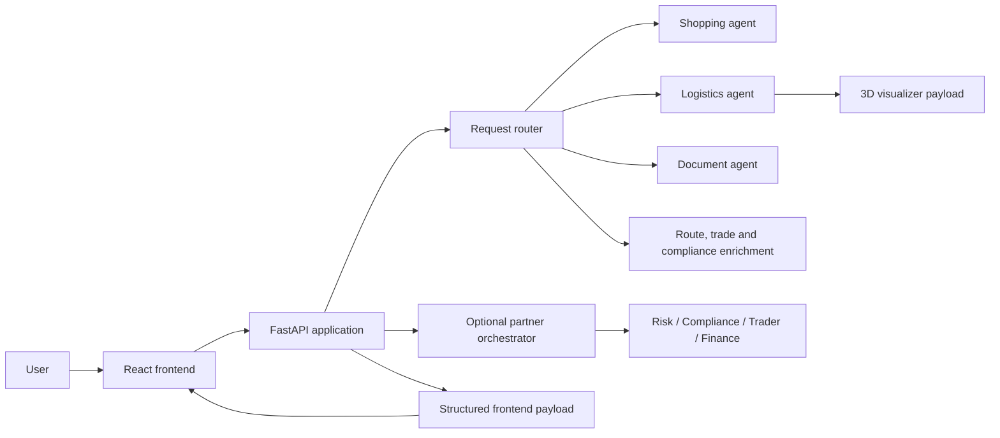

# Logistics Agent

A modular logistics-planning application with a React frontend, FastAPI backend, specialist agents, deterministic calculations, optional LLM interpretation, route and document guidance, landed-cost analysis, and a 3D container-loading visualizer.

Repository: `https://github.com/Nightshade23x/logistics-agent.git`

## Current status

The application is ready for local demonstration and consultant review.

The main local workflow runs in standalone mode. Optional partner services can contribute Risk, Compliance, Trader, and Finance responses when configured and available.

## Main capabilities

- Free-text and guided shipment input with synchronized request state.
- Procurement and supplier-selection workflows.
- CBM, weight, load-type, and container recommendations.
- 3D container-loading visualization with utilization and remaining capacity.
- Indicative route and gateway planning.
- Landlocked-origin inland pre-carriage guidance.
- Trade-agreement, rules-of-origin, and proof-of-origin guidance.
- Shipping-document requirements and trade-compliance readiness.
- Fragile, non-stackable, hazardous, perishable, and specialist-cargo handling.
- Landed-cost calculations and missing-commercial-input checks.
- Dynamic serpentine shipment-process flowchart.
- Safe fallback behaviour when optional integrations are unavailable.

## Architecture



Deterministic backend fields remain authoritative for calculations and structured status. LLMs are optional interpretation fallbacks.

## Repository structure

```text
app/                  Backend routing, services, enrichment, and payload assembly
frontend/             React/Vite interface and 3D visualizer
shopping_agent/       Procurement and supplier logic
trader_agent/         Trade and agreement reference logic
compliance_agent/     Compliance specialist components
finance_agent/        Finance specialist components
risk_agent/           Risk specialist components
orchestrator_agent/   Multi-agent orchestration
data/                 Reference data and demonstration scenarios
scripts/              Demo commands, diagnostics, and regression tests
docs/                 Architecture and specialist documentation
Start-Logistics-App.ps1
```

## Prerequisites

- Windows 10 or 11 with PowerShell
- Python 3.11 or newer
- Node.js and npm
- Git
- A modern Chromium-based browser

## Local installation

### 1. Clone the repository

```powershell
git clone https://github.com/Nightshade23x/logistics-agent.git
cd logistics-agent
```

### 2. Create the Python environment

```powershell
python -m venv .venv
.\.venv\Scripts\Activate.ps1
python -m pip install --upgrade pip
pip install -r requirements.txt
```

### 3. Install frontend dependencies

```powershell
cd frontend
npm install
cd ..
```

### 4. Configure optional environment variables

Create a local `.env` file only when optional integrations are required.

```text
GEMINI_API_KEY=
TRADE_ORCHESTRATOR_BASE_URL=
OPENAI_API_KEY=
VITE_API_BASE_URL=
```

Never commit real credential values.

## Start the application

From the repository root:

```powershell
powershell -ExecutionPolicy Bypass -File .\Start-Logistics-App.ps1
```

The launcher is the authoritative source for local backend and frontend startup configuration.

After frontend changes, press `Ctrl+F5` in the browser.

## Frontend production build

```powershell
cd frontend
npm run build
cd ..
```

## Final focused regression tests

Run from the repository root:

```powershell
$env:PYTHONPATH = (Get-Location).Path

python scripts/test_dynamic_process_flow_v62.py
python scripts/test_compact_flow_board_v62.py
python scripts/test_serpentine_flow_board_v62.py
python scripts/test_compact_synced_input_flow_v62.py
python scripts/test_blank_entry_fullwidth_flow_v62.py
python scripts/test_frontend_persistence_docs_cbm_v61.py
```

Additional focused regression and demo scripts are available under `scripts/`.

## Suggested demo flow

1. Submit a complete ordinary shipment request.
2. Review CBM, weight, load type, container, route, documents, and compliance.
3. Open the 3D container-loading visualizer.
4. Switch between free-text and guided input to demonstrate synchronized request state.
5. Run a landlocked-origin scenario.
6. Run a dangerous-goods scenario.
7. Show the dynamic serpentine process flow.
8. Show a completed landed-cost request and an incomplete request.

## Operating modes

### Standalone mode

The core application works without external partner services. Deterministic logistics calculations, visualizer payloads, route guidance, document advice, and safe fallback output remain available.

### Partner-integrated mode

Set `TRADE_ORCHESTRATOR_BASE_URL` and start compatible partner services when live Risk, Compliance, Trader, or Finance responses are required.

Do not present partner output as live unless those services were checked immediately before the demonstration.

## Important limitations

- Routes are indicative and are not live carrier bookings.
- Port closures, congestion, weather, sanctions, and maritime advisories are not connected by default.
- Agreement existence does not prove product eligibility.
- Preferential treatment requires the correct HS code, product-specific rules of origin, and accepted proof of origin.
- Container visualizations are planning aids, not certified loading plans.
- Document and compliance guidance is not legal, customs, or insurance advice.
- Production authentication, monitoring, deployment, and persistent storage require further work.

## Security

- Never commit `.env`, API keys, tokens, credentials, private documents, or generated logs containing request URLs.
- Rotate any key exposed in screenshots, terminal output, logs, or Git history.
- This repository is public, so every committed file should be treated as internet-visible.
- Use demonstration data rather than confidential customer or shipment records.

## Consultant handover

Before merging into `main`:

1. Run the frontend production build.
2. Run the final focused regressions.
3. Review the feature-branch diff.
4. Scan the public repository for secrets and local generated files.
5. Push the feature branch.
6. Open a Pull Request into `main`.
7. Merge only after review.
8. Tag the mentor-approved handover commit.

## License

No license is currently selected. The repository owner should choose one before external reuse or redistribution.
