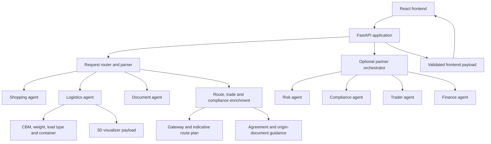

# Architecture

## Overview

The Logistics Agent application separates user interaction, deterministic logistics logic, specialist review, optional model interpretation, and presentation.

## Design principles

### Deterministic calculations are authoritative

CBM, weight, utilization, landed cost, route fields, document lists, and structured statuses should come from deterministic or validated backend logic.

Optional model output may help interpret the user's wording, but it must not silently override authoritative structured fields.

### Structured payloads drive the interface

The frontend should render from structured response objects rather than scrape or reinterpret the final prose answer.

This applies to:

- logistics metrics;
- the 3D visualizer;
- route and gateway details;
- document and compliance sections;
- trade-agreement guidance;
- landed-cost status;
- the dynamic process flowchart.

### Optional integrations fail safely

The application must remain usable when partner services are not configured or temporarily unavailable.

Standalone mode should still return a valid frontend payload with clear fallback status.

### Indicative guidance is clearly labelled

Route plans, trade guidance, and compliance recommendations must be distinguished from:

- live carrier schedules;
- current port or canal conditions;
- legally confirmed customs treatment;
- certified loading plans;
- binding insurance advice.

## Frontend

The frontend is built with React and Vite.

Main responsibilities:

- accept free-text and guided shipment input;
- keep both input modes synchronized;
- preserve the active request until the user explicitly clears it;
- present shipment, compliance, report, and container-planning views;
- render the 3D container-loading visualizer;
- render the compact serpentine process flow;
- show safe loading and error states.

The process flow is generated from structured backend fields and changes according to route, cargo risk, missing information, documents, insurance, and landed-cost readiness.

## Backend

The FastAPI application is responsible for:

- accepting text, JSON, and document requests;
- routing requests to the correct specialist logic;
- calculating logistics metrics;
- enriching routes, gateways, trade agreements, and documents;
- assembling compact and detailed frontend payloads;
- validating response structure;
- providing safe fallbacks when external services are unavailable.

## Specialist modules

### Shopping agent

Handles procurement-oriented requests, supplier selection, and shopping-to-logistics handoff.

### Logistics agent

Handles:

- dimensions and unit normalization;
- CBM and weight;
- FCL/LCL suitability;
- container recommendations;
- physical-fit checks;
- fragile, hazardous, perishable, oversized, and non-stackable handling;
- loading sequence and visualization data.

### Document agent

Handles:

- document extraction;
- document quality;
- invoice and packing-list comparison;
- document-set completeness;
- shipment and compliance handoff fields.

### Route, trade, and compliance enrichment

Handles:

- origin and destination normalization;
- explicit or reference gateway selection;
- landlocked-origin pre-carriage;
- indicative route steps;
- agreement lookup;
- origin-document guidance;
- trade-compliance readiness.

### Optional partner services

The partner orchestrator may call Risk, Compliance, Trader, and Finance services.

These services are optional for the local standalone demo.

## Request lifecycle

1. The user submits a request.
2. The frontend sends the request to the FastAPI application.
3. The router extracts shipment, route, cargo, commercial, and document inputs.
4. Deterministic modules calculate logistics metrics.
5. Route and trade enrichment adds gateway and origin-document guidance.
6. Optional partner services contribute specialist review when available.
7. Payload validation normalizes the final response.
8. The frontend renders cards, reports, the visualizer, and the process flow.

## Data and reference sources

Reference files under `data/` and specialist-agent folders support demo calculations and local guidance.

Before production use, data sources should be reviewed for:

- ownership;
- update frequency;
- jurisdiction coverage;
- licensing;
- auditability;
- stale-data handling.

## Known architectural limitations

The current repository is a local demonstration and handover candidate.

Production work still requires decisions on:

- deployment architecture;
- persistent storage;
- authentication and authorization;
- rate limiting;
- observability and centralized logging;
- live carrier and port data;
- audited tariff and sanctions sources;
- dependency and vulnerability scanning;
- CI/CD and branch protection.
